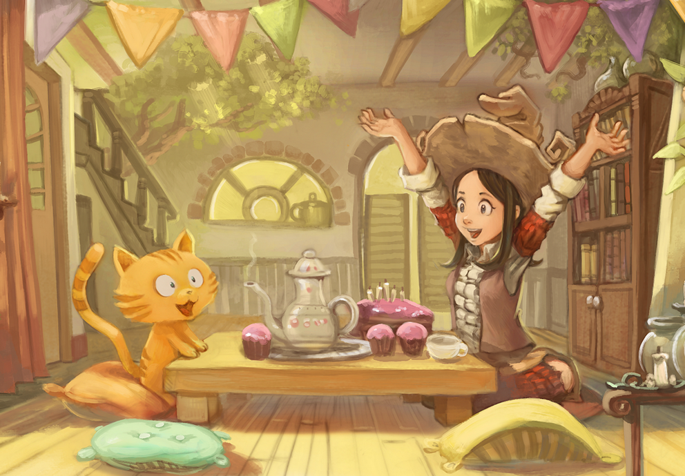

# Pepper&Carrot translation project
# Episode 08 : Pepper's Birthday Party

[http://www.peppercarrot.com](http://www.peppercarrot.com)

License
=======

[Creative Commons Attribution 3.0](https://creativecommons.org/licenses/by/3.0/)

## Translators and correctors :

* Arabic     : Mahwiii

* Català     : Juan José Segura

* English    : Alex Gryson

* French     : David Revoy

* German     : Alexandra Jordan, Helmar Suschka

* Italian    : Carlo Gandolfi

* Russian    : Denis "uncle Night" Prisukhin

* Japanese   : guruguru

## Fonts:

* Latin (main): Lavi by Ruben Holthuijsen aka Rholt [GNU GPL V3](http://www.gnu.org/copyleft/gpl.html) [link](http://www.dafont.com/lavi.font)

* Latin (book&labels): Robokoz  by Ray Larabie, rlarabie@hotmail.com [CC-0 / Public Domain], [link](http://dafont.me/view_file/175/UmVhZF9NZS50eHQ=/read_me.txt)

* Latin (monster-speech): DrukaatieBurti  by Kārlis Kalviškis, Zirneklitis on [OFL / SIL Open Font License], [link](http://openfontlibrary.org/en/font/drukaatieburti)

* Cyrilic (main): Neucha by [Jovanny Lemonad](https://plus.google.com/115426726897976242009/about), [SIL Open Font License](http://scripts.sil.org/OFL), [link](https://www.google.com/fonts/specimen/Neucha)

* Cyrilic (monster-speech): RuslanDisplay by [Denis Masharov](https://plus.google.com/106558435145097149719/about), [SIL Open Font License](http://scripts.sil.org/OFL), [link](https://www.google.com/fonts/specimen/Ruslan+Display)

* Japanese (main): rounded-mplus-1c-medium.ttf from Rounded M+ by MM [MFont+ license]　(http://jikasei.me/font/rounded-mplus/license.html), [link] (http://jikasei.me/font/rounded-mplus/about.html)

* Arabic (title): Alhor by Nadim Shaikli [GNU GPL](http://www.gnu.org/copyleft/gpl.html), [link](http://openfontlibrary.org/en/font/alhor)

* Arabic (main): Midan-Normal by Almohtaraf Assaudi[MIT License](http://opensource.org/licenses/mit-license.php), [link](http://openfontlibrary.org/en/font/midan-normal)

* Arabic (main): Midian-Black by Kameel Hawa[MIT License](http://opensource.org/licenses/mit-license.php), [link](http://openfontlibrary.org/en/font/midan-black)

* Arabic (book&labels) : Droid Arabic Kufi By Pascal Zoghbi [Apache License 2.0]( http://www.apache.org/licenses/LICENSE-2.0), [link]( http://www.fontsc.com/font/droid-arabic-kufi)

* Arabic (monster) : Tholoth By Nadim Shaikli [GNU GPL] (http://www.gnu.org/copyleft/gpl.html), [link](http://openfontlibrary.org/en/font/tholoth)

## Artwork :

* David Revoy, www.peppercarrot.com

Info :
=======

- Translation/Correction [full how-to documentation](http://www.peppercarrot.com/fr/article267/how-to-add-a-translation-or-a-correction)

- Resources added to this project must be compatible with the CC-By license ( fonts, images, etc ). Are compatible : Public domain fonts, GNU/GPL fonts, CC-0 fonts, CC-BY fonts, SIL Open Font License (OFL). Adding author name plus a link and license is appreciated.

- Do not edit or propose a commit for the artwork in these repositories. Artwork here are low-resolution proxy files only. The real hi-res layered artwork,  *.kra files, are [available here] www.peppercarrot.com/static6/sources.
